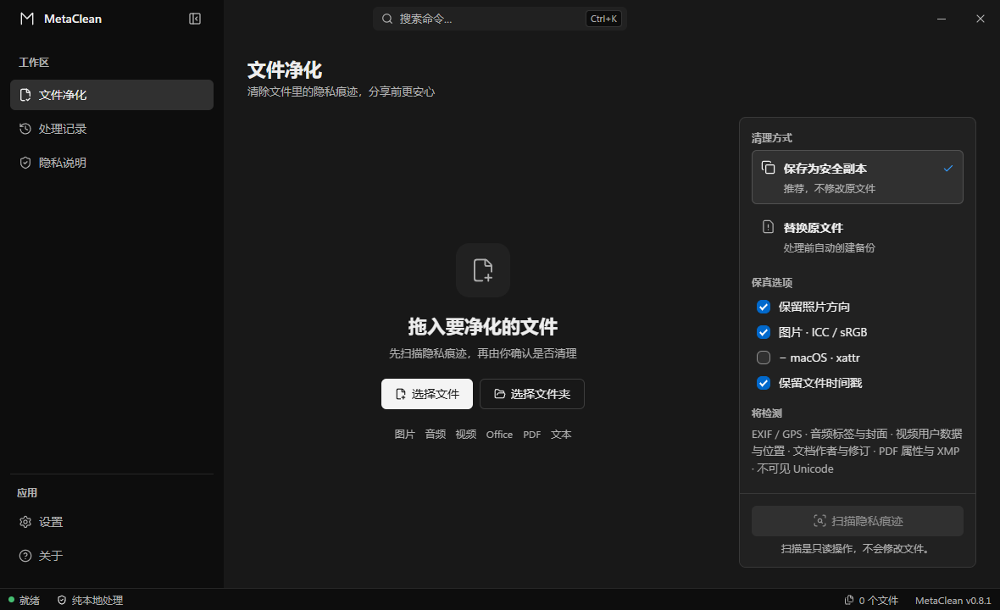

<div align="center">


# MetaClean

**分享文件之前，先清掉里面的隐私痕迹。**

文件纯本地处理 · 可关闭的版本检查 · 无需 ExifTool / Python / Perl · Rust 内核

[](https://github.com/Moresyl/metaclean/actions/workflows/ci.yml)
[](https://github.com/Moresyl/metaclean/releases)
[](LICENSE)
[](https://github.com/Moresyl/metaclean/releases/latest)
[](src-tauri)

[English](README.md) · **简体中文**



</div>

---

照片里藏着 GPS 坐标。Word 文档里留着你的姓名、单位，以及那些你以为已经删干净的修订记录。PDF 会把每一版旧草稿的元数据一并带上。从大模型里复制出来的文字，则夹带着看不见的 Unicode 字符。

MetaClean 把这些统统找出来并清除——全过程只在你自己的电脑上完成。

## 为什么用它

- **文件绝不出本机。** 没有上传接口、遥测或云端处理。可选的版本检查只请求官方 GitHub Releases，并且可以关闭。
- **不用先装一堆东西。** 单个可执行文件，无需 Python、Perl、ExifTool 或任何运行时。
- **先扫描，再决定。** 扫描是只读操作，逐个文件列出检测结果，确认之后才会写入。
- **默认就是安全的。** 替换原文件前强制备份，写入为原子操作，默认模式只生成 `.cleaned` 副本而不覆盖原件。
- **能力边界写在明处。** 无法安全处理的格式直接拒绝，绝不假装处理过。

## 下载

前往 [GitHub Releases](https://github.com/Moresyl/metaclean/releases/latest) 获取最新安装包。

| 平台 | 安装包 |
| --- | --- |
| Windows | `.exe`（NSIS）· `.msi` |
| macOS | `.dmg` —— Apple Silicon 与 Intel 双架构 |
| Linux | `.deb` · `.rpm` · `.AppImage` |

## 清理范围

| 格式 | 扩展名 | 清理内容 |
| --- | --- | --- |
| JPEG | `.jpg` `.jpeg` | EXIF/GPS、XMP、IPTC、图片注释、JUMBF/C2PA 段 |
| PNG | `.png` | EXIF、文本元数据、C2PA/JUMBF 块 |
| WebP | `.webp` | EXIF、XMP、C2PA 块 |
| GIF | `.gif` | 注释与 XMP 应用元数据，不重新编码动画帧 |
| 音频 | `.mp3` `.wav` `.flac` | ID3/APEv2、RIFF INFO/XMP/BWF/iXML、FLAC Vorbis 评论、封面与 XMP |
| Office | `.docx` `.xlsx` `.pptx` `.odt` | 作者与应用属性、批注、自定义 XML；DOCX 修订会被固化——接受插入内容，移除删除标记内容 |
| PDF | `.pdf` | 移除 Info 字典与 XMP，再完整重序列化，丢弃残留在增量更新历史里的元数据 |
| 文本与标记 | `.txt` `.md` `.markdown` `.html` `.htm` `.svg` `.xml` `.json` `.csv` | 不可见 Unicode，以及 Markdown Front Matter、HTML、SVG 中的作者/生成器信息 |

**明确不做的事：** 统计型文本水印、像素域水印、视频、旧版二进制 Office 文件（`.doc` / `.xls` / `.ppt`）以及未知二进制格式。遇到这些，MetaClean 会直接拒绝，而不是冒险改坏你的文件。

## 安全保障

- 替换原文件前，一定先写入 `.bak` 备份
- 默认生成 `.cleaned` 安全副本
- 先写临时文件，再原子替换目标文件
- 输入和输出路径都拒绝符号链接
- 单文件上限 256 MiB，Office 解压总量上限 512 MiB
- 文件损坏或格式不支持时直接失败，绝不改动源文件

## 桌面端

- 支持批量拖入文件或文件夹，也可以用系统原生选择器递归导入目录
- 四个页面：**文件净化**、**处理记录**、**隐私说明**、**设置**
- 可选的 Windows 资源管理器右键菜单，覆盖全部 22 种受支持扩展名（Windows 11 上位于**显示更多选项**中）
- 关闭窗口后驻留系统托盘，右键托盘图标可重新打开或彻底退出
- 默认保留 JPEG 显示方向与文件时间戳，但不会保留其他私密 EXIF 字段
- 通过 GitHub Releases 发现稳定版，启动检查可以单独关闭
- 中英文界面、跟随系统/浅色/深色主题、输出方式、保真选项、本地处理记录都会持久保存

## 从源码构建

需要 [Rust](https://rustup.rs)、[Node.js](https://nodejs.org) 和 [pnpm](https://pnpm.io)，以及对应平台的 [Tauri 系统依赖](https://tauri.app/start/prerequisites/)。

```bash
pnpm install
pnpm tauri dev      # 以开发模式运行
```

提交 Pull Request 前请跑完整套检查：

```bash
pnpm test:coverage                              # 前端测试，覆盖率不低于 80%
pnpm build                                      # 类型检查 + 生产构建
cargo test --manifest-path src-tauri/Cargo.toml # Rust 内核测试
pnpm tauri build                                # 各平台安装包
```

推送版本标签后，GitHub Actions 会构建完整矩阵：Windows 的 NSIS 与 MSI、macOS 的 Apple Silicon 与 Intel 双 DMG、Linux 的 DEB/RPM/AppImage。macOS 签名与公证需要配置发布工作流中列出的 Apple 密钥；未配置时 macOS 任务仍会产出未签名安装包。

测试覆盖率与发布验收证据记录在 [VALIDATION.md](VALIDATION.md)。

## 参与贡献

欢迎提交 Pull Request，请先阅读 [CONTRIBUTING.md](CONTRIBUTING.md)。安全相关问题请按 [SECURITY.md](SECURITY.md) 的流程，走私密漏洞报告渠道，不要开公开 issue。

## 责任使用

请只处理你拥有或已获授权的内容。MetaClean 是为隐私保护和文件卫生而做的——不是用来学术造假、伪造来源，或对文件出处作出误导性声明。

## 许可证

[MIT](LICENSE) © Moresyl
