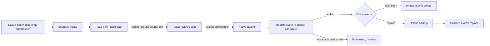

# MetaClean architecture

> Status: current for the `0.7.x` source line
> Audience: maintainers, security reviewers and release engineers
> Owners: MetaClean maintainers
> Evidence: the linked source modules, automated gates and `VALIDATION.md`
> External limits: Word/WPS interoperability and Apple signing remain separately qualified

MetaClean is a local-first desktop privacy cleaner. Its architecture is built
around one rule: no output path, backup or source replacement exists until the
exact candidate bytes have been re-detected and inspected successfully.

## System map

The update path is separate from file processing. It can request only the two
official signed feeds and never receives a file path, file content, scan result
or history record.

## Non-negotiable invariants

| Invariant | Enforcement | Primary evidence |
| --- | --- | --- |
| User content stays local | No upload/telemetry command; production CSP limits network access to updater IPC | `src-tauri/capabilities/default.json`, `scripts/verify-csp.mjs` |
| Scan never writes | Scan commands call isolated readers only | `src-tauri/src/lib.rs`, `src-tauri/src/engine.rs` |
| Candidate verification precedes every output | Cleaners re-detect and inspect in-memory bytes before allocation | `engine::verify_cleaned_data`, engine regressions |
| Replacement is recoverable | A unique backup is created before guarded atomic replacement | `src-tauri/src/safe_io.rs` |
| Source races fail closed | Bytes, modification time, permissions and extended attributes are checked twice | guarded-write tests in `safe_io.rs` |
| UI never receives raw metadata values | IPC models contain finding categories and counts only | `src-tauri/src/models.rs`, `src/types.ts` |
| One physical Windows path is one batch item | Native and frontend use the same slash/case/device/UNC identity | `lib.rs::path_key`, `files.ts::pathIdentity` |
| Long work remains interruptible | Cleanup observes cancellation between files; close is blocked during native work | batch and close-guard tests |

## Module ownership

| Area | Source | Responsibility |
| --- | --- | --- |
| Desktop shell and IPC | `src-tauri/src/lib.rs` | Commands, menus, tray, updater and work lifecycle |
| Intake | `src-tauri/src/intake.rs` | Recursive discovery, budgets, skip reasons and link refusal |
| Detection and orchestration | `src-tauri/src/engine.rs` | Signature detection, inspection, cleaning and candidate verification |
| Format parsers | `src-tauri/src/cleaners/` | Bounded, format-specific metadata removal |
| File commit layer | `src-tauri/src/safe_io.rs` | Snapshot validation, unique paths, backups and atomic writes |
| Application workflow | `src/App.tsx` | Scan/confirm/clean state machine, cancellation and recovery notice |
| Queue reconciliation | `src/lib/files.ts` | Classification, de-duplication and native-result matching |
| Persisted state | `src/lib/history.ts`, `storage.ts`, `recovery.ts` | Bounded history, safe settings and path-free crash markers |
| Release gates | `.github/workflows/`, `scripts/` | Package validation, smoke tests, signatures, checksums and feeds |

## IPC and state boundaries

- Intake IPC may carry paths because the native process must open the selected
  files. Paths stay inside the installed application process.
- Scan responses contain the source path, detected format, size, category,
  severity and count. They do not contain the underlying metadata value.
- Progress events contain only operation, batch token, counts and cancellation
  state. A stale or foreign batch token is ignored by the UI.
- Cleanup recovery stores batch token, total/completed counts, mode and start
  time. It never stores paths. Normal completion, cancellation and visible
  errors remove the marker; only an abnormal exit leaves a one-time notice.
- Audit exports deliberately contain paths and outcomes because the user asks
  to save them. The native writer accepts JSON only, caps it at 10 MiB and
  commits atomically.

## Concurrency and backpressure

Read-only scans use at most two native workers and preserve input order. Cleanup
is sequential by design: it provides predictable disk pressure, deterministic
output naming, a file-boundary cancellation point and a simple backup order.
The opt-in `pnpm test:benchmark` gate measures the current release-mode baseline.
Any future cleanup parallelism must prove bounded memory, deterministic writes,
source-race protection and cancellation latency before replacing this design.

## Documentation truth order

When two documents disagree, resolve the mismatch against this order:

1. Runtime source and tests define actual behavior.
2. `SUPPORT_POLICY.md` defines the accepted safety contract.
3. `VALIDATION.md` records what was actually run and what remains external.
4. `README.md` and `README.zh-CN.md` summarize the product for users.
5. `COMPETITIVE_AUDIT.md` compares only evidence available at its dated baseline.
6. `CHANGELOG.md` records historical changes and is not a current capability map.

## Change checklist

A behavior change is incomplete until its code, failure-path test, user-facing
description and relevant manifest agree. New formats additionally need malformed
input coverage, payload-preservation proof and post-clean verification. Release
claims additionally require package-level runtime evidence; a source build or CI
configuration alone does not prove install, update, rollback or notarization.
