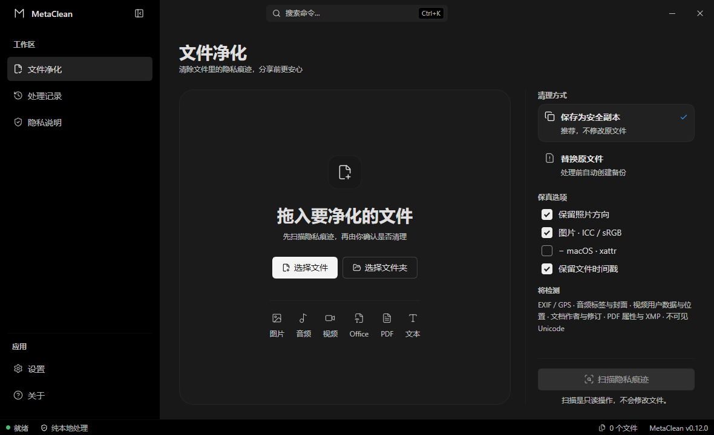
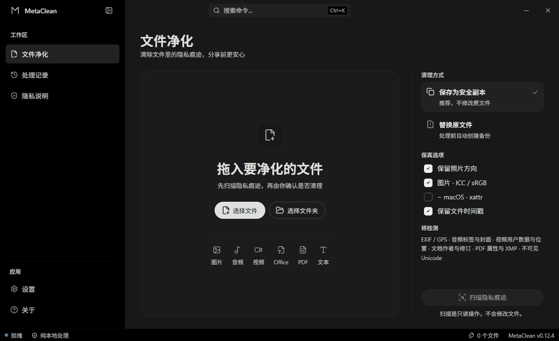
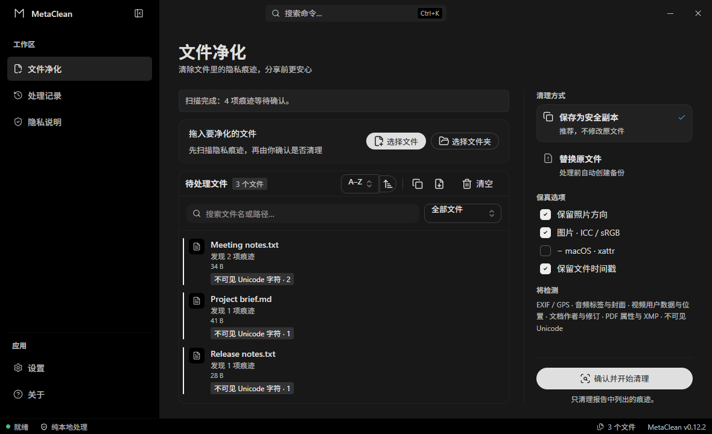

# 用户指南

## 实际操作

演示使用合成示例文件和真实桌面引擎，播放两轮后停止。

队列搜索支持文件名和原始、输出、备份路径；支持大小写与全角字符归一化，
路径中的正反斜杠均可匹配。下拉框可筛选待清理项或失败项，Escape 清除筛选。
**筛选仅改变显示，批量操作仍针对整个队列。** 待清理筛选会遵循当前方向、ICC 与
macOS 扩展属性选项，已清理成功的文件不会继续列为待清理项。

> 当前界面使用可折叠工作区导航、固定状态栏和单一主操作区；安装与卸载界面沿用同一套中性明暗层级和品牌图形。

## 推荐流程

1. 拖入文件或文件夹，等待受限导入完成。
2. 点击“扫描隐私痕迹”，只查看类别和数量，不展示原始元数据值。
3. 在右侧选择安全副本或替换并备份，再明确确认清理。
4. 检查每个结果的状态、输出路径和失败原因；失败项可以单独重试。
5. 使用队列工具栏复制路径或导出不含原始元数据值的审计 JSON。

成功清理后，文件详情中的 **SHA-256** 可展开查看原始字节与输出字节的校验摘要。
审计 JSON 的可选 `integrity.sourceSha256`、`integrity.outputSha256` 字段保存相同摘要，
用于与文件校验工具的结果比对。替换模式下，原始摘要对应备份中的文件内容。
摘要描述清理完成时的字节，不代表之后文件未被修改，也不包含文件系统扩展属性。
旧版历史与仅扫描的条目没有摘要；摘要不是数字签名，也不是清理完整性的额外证明。

## 处理模式

| 模式 | 行为 | 适用场景 |
| --- | --- | --- |
| 安全副本 | 保留源文件，创建唯一 `.cleaned` 输出 | 首次处理、需要回滚或需要对比 |
| 替换并备份 | 先创建唯一备份，再执行受保护的原子替换 | 已确认结果且需要原路径继续使用 |

## 明确边界

JPEG 清理会保留有效的 EXIF 打印密度和单位，分别保留横向、纵向精度，不重新编码像素。
仅含重建方向信息的扫描结果不再算作隐私痕迹；关闭“保留 JPEG 显示方向”后仍可移除方向。
打印密度不完整、类型错误、分母为零或相互冲突时，会拒绝清理并保留源文件。
这项规则同样适用于通过 JPEG 清理器处理的 PDF 内嵌图片；不代表所有文档或打印应用都已验证。

- 文件不上传，不经过远程 AI 或统计重写服务。
- 未识别、损坏、超预算、符号链接或重解析点会失败关闭；如果文件位于
  链接/重解析点父目录下，也会拒绝读取或写入，避免路径被重定向到另一棵目录树。
- 单个导入路径最多 32 KiB，单次原始导入请求最多 64 MiB；超出预算会在启动扫描前
  直接提示，不会创建后台任务。
- 同一批次会在读取时按平台路径规则去重，最多保留 10,000 个唯一文件；即使全部
  重复，原始输入也最多读取 40,000 项，避免重复拖放误伤或造成无界等待。
- 拖放或选择批次超过 64 MiB 的路径数据会整体拒绝，不会只处理前半批而造成误解。
- 浏览器回退文件选择超过 10,000 项时也会整体拒绝，不会静默截断后半批。
- 浏览器选择文件夹时会使用受限的相对路径区分同名文件；不同目录中即使大小和修改时间相同，也不会被错误合并。
- 可见队列最多保留 10,000 个唯一文件；队列已满时继续导入会明确提示未加入的数量，先处理当前队列即可继续下一批。
- “复制全部路径”限制为 16 MiB UTF-8 剪贴板数据；过大时会提示分批复制，不会卡住界面或静默丢失路径。
- 审计报告超过 10 MiB 时会提示分批导出；导出对话框等待期间离开队列页面也不会继续写盘。
- 递归目录展开也限制返回路径总量；超出时会停止继续加入文件，并将问题路径安全截断。
- 解析器、文件系统和更新错误会统一限制为 8 KiB，并安全截断到完整 UTF-8 字符，避免损坏文件的错误文本拖慢界面。
- 可见水印、统计型文本水印和旧版二进制 Office 不属于本工具范围。
- Word/WPS 当前仍需要真实应用打开、保存、再次读取的外部验证。

## 出问题时

扫描失败不会锁死队列，重新扫描只会重试仍未完成或扫描失败的文件，不会抹掉已经成功的报告和输出。清理中取消只会在文件边界生效，已经完成的结果保留，未处理项可以重试。v0.11.3 在清理前保存不含路径的原生中断记录，正常结束后删除；异常退出后只提示重新导入和扫描，不会自动恢复文件操作。公开包已通过记录的 Windows 强制退出测试，场景和边界见[验证账本](./validation)。

强制结束进程可能绕过临时文件清理。重启提示不代表输出目录中绝无遗留文件；应用不会根据临时文件名自动删除来源未确认的文件。需要中止清理时，优先使用应用内取消并等待当前文件处理结束。

详细安全模型见 [架构](./ARCHITECTURE) 与 [支持策略](./support-policy)。
